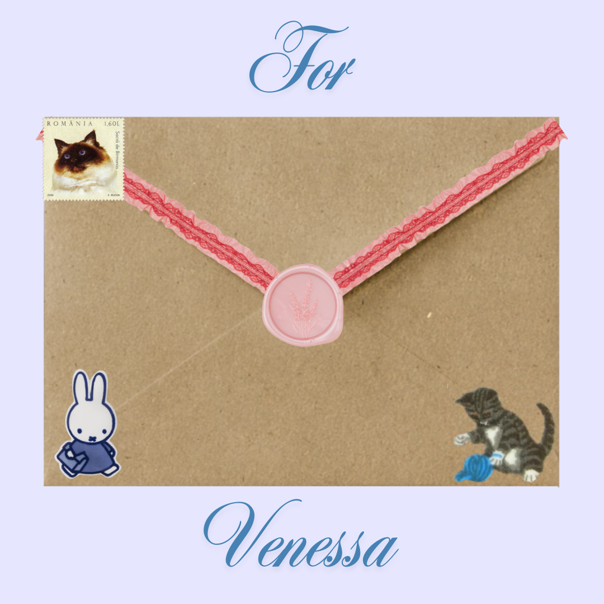

find your name ~
---

<!-- <form onSubmit="return redirectPg();">
  <input id="userID" type="text" maxlength="3" />
  <input type="submit" class="submit" value="SUBMIT" />  
  <!-- <input onclick="return findProject()" type="submit" value="Go"/> 
</form> -->

<!--  -->

